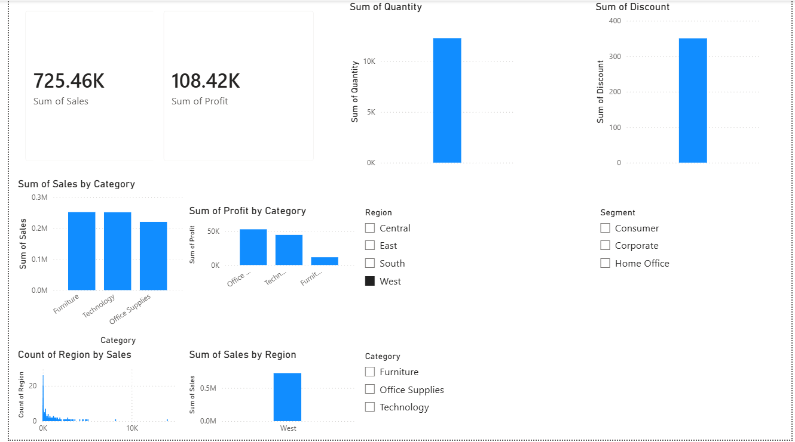
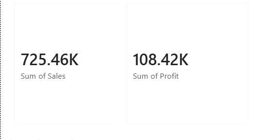
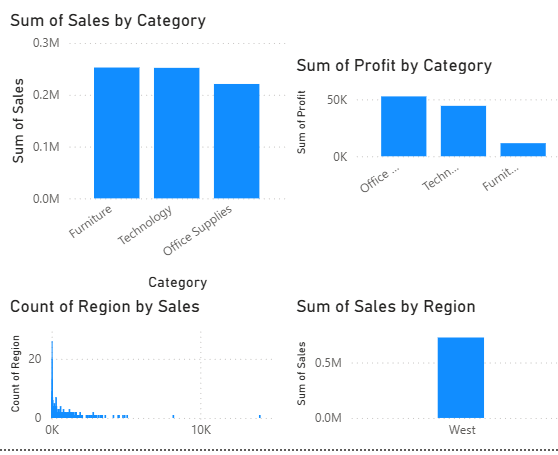

# Superstore Sales Dashboard

##  Project Overview

This project presents an interactive sales dashboard created using Microsoft Power BI.

The dashboard helps analyze sales performance, profit, customer segments, and regional performance using interactive visualizations.

---

##  Objective

The objective of this project is to transform raw sales data into meaningful business insights through effective data visualization and storytelling.

---

## 🛠 Tools Used

- Microsoft Power BI
- Microsoft Excel / CSV Dataset
- GitHub
- VS Code

---

##  Dataset

SampleSuperstore.csv

---

##  Dashboard Features

- Total Sales KPI
- Total Profit KPI
- Total Quantity KPI
- Average Discount KPI
- Sales by Category
- Profit by Category
- Sales by Region
- Sales by Segment
- Interactive Slicers

---

##  Dashboard Preview

(Add screenshots here after completing the dashboard.)

---

##  Business Insights

- Technology category contributes significant sales.
- Profit varies across different categories.
- Regional analysis helps identify top-performing markets.
- Customer segments contribute differently to total sales.
- Interactive filters enable better business analysis.

##  Conclusion

This dashboard converts raw sales data into meaningful business insights, enabling faster and better business decisions through interactive visualization.

## 📷 Dashboard Preview

### Dashboard Overview

### KPI Cards

### Category Analysis

### Regional Analysis

